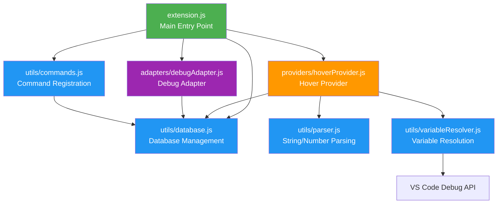

# HoverLookup

> **Instantly see what those IDs, codes, and numbers in your code actually mean.**

Stop switching between your code and database queries. HoverLookup brings your data directly into your editor—just hover over any ID, code, or variable to see the full record from your JSON database.

---

## Why HoverLookup?

Ever found yourself staring at code like this?

```javascript
const user = getUser(12345);
processOrder("ORD-2024-ABC");
```

**What does `12345` mean? Who is that user? What's in order `ORD-2024-ABC`?**

With HoverLookup, you **hover** and instantly see:

```json
{
  "id": 12345,
  "name": "Sarah Johnson",
  "email": "sarah@example.com",
  "role": "admin"
}
```

---

## Key Features

### Hover Over Anything
- **Literals**: Hover over `1`, `"abc"`, or any value in your code (works in any language)
- **Variables**: Hover over variables during debugging to see their runtime value + database info
- **Language support**: Literals work everywhere; variable analysis optimized for JavaScript/TypeScript

### Smart & Flexible
- **Dynamic ID field**: Use `id`, `userId`, `code`, `sku`, or any field as your lookup key
- **Auto-reload**: Database updates automatically when your JSON file changes
- **Debug integration**: Works seamlessly with VSCode's debugger

### Zero Configuration
1. Run `HoverLookup: Initialize Database` command
2. Add your data to the JSON file
3. Start hovering—that's it!

---

## Quick Start

### 1. Initialize the Database

Open the Command Palette (`Ctrl+Shift+P` / `Cmd+Shift+P`) and run:

```
HoverLookup: Initialize Database
```

This creates a `lookup-database.json` file with an example structure.

### 2. Add Your Data

Edit the JSON file with your own data. You can use a **single field** or **multiple fields** for lookups:

**Single ID field:**
```json
{
  "idField": "id",
  "data": [
    {"id": 1, "name": "John Doe", "email": "john@example.com"},
    {"id": 2, "name": "Jane Smith", "email": "jane@example.com"}
  ]
}
```

**Multiple ID fields (mix different object types):**
```json
{
  "idField": ["id", "userId", "code"],
  "data": [
    {"id": 1, "name": "John Doe", "role": "admin"},
    {"userId": 42, "name": "Jane Smith", "department": "Engineering"},
    {"code": "ORD-2024-001", "status": "shipped", "total": 299.99}
  ]
}
```

When using multiple fields, the extension will try each field in order until it finds a value.

### 3. Start Hovering!

```javascript
const userId = 1;              // Hover over "1" → see John Doe's info
const employee = 42;           // Hover over "42" → see Jane Smith's info
const order = "ORD-2024-001";  // Hover over "ORD-2024-001" → see order details
```

---

## Commands

| Command | Description |
|---------|-------------|
| **Initialize Database** | Create a new `lookup-database.json` file with example data |
| **Reload Database** | Manually reload the database from the JSON file |
| **Change ID Field** | Change lookup field(s). Use comma-separated values for multiple fields (e.g., `id, userId, code`) |
| **Show Lookup for Selection** | Show database info for selected text |

---

## Advanced Configuration

### Custom Database Path

Set a custom path in your VSCode settings:

```json
{
  "hoverLookup.databasePath": "data/my-custom-db.json"
}
```

### Multiple ID Fields

Mix different types of objects in the same database by using multiple ID fields:

```json
{
  "idField": ["id", "code", "sku"],
  "data": [
    {"id": 1, "name": "User Record", "email": "user@example.com"},
    {"code": "ABC", "name": "Product Code", "category": "Electronics"},
    {"sku": "PROD-001", "name": "Widget", "price": 29.99}
  ]
}
```

The extension will try each field in order until it finds a match. Use the **Change ID Field** command to modify the field list (comma-separated: `id, code, sku`).

---

## How It Works

HoverLookup operates in two intelligent modes:

### Normal Editing Mode
Detects literals and variables using static analysis, then looks them up in your database.

### Debug Mode
Intercepts the debugger's variable evaluation, extracts runtime values, and enriches the hover with database information.

**Both modes work seamlessly together** to give you the information you need, when you need it.

---

## Architecture

Built with a clean, modular structure for maintainability and extensibility:



<details>
<summary><b>Module Organization</b></summary>

- **`extension.js`** - Main entry point (63 lines)
- **`utils/database.js`** - Database loading, reindexing, and path management
- **`utils/parser.js`** - String/number extraction and range detection
- **`utils/variableResolver.js`** - Variable value resolution (debugger + static analysis)
- **`utils/commands.js`** - Command registration
- **`providers/hoverProvider.js`** - Hover provider implementation
- **`adapters/debugAdapter.js`** - Debug adapter tracker classes

</details>

---

## Requirements

- **VSCode** 1.60.0 or higher
- A `lookup-database.json` file in your workspace (created automatically with the Init command)

---

## Known Limitations

- **Literal detection** (strings, numbers) works in all languages
- **Variable static analysis** is optimized for JavaScript/TypeScript syntax (`const`, `let`, `var`)
- For other languages or complex expressions, use the debugger for accurate variable lookups
- Static analysis only works for simple assignments in the same file
