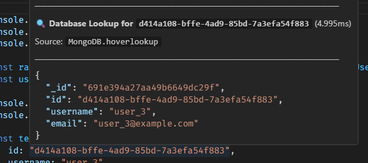
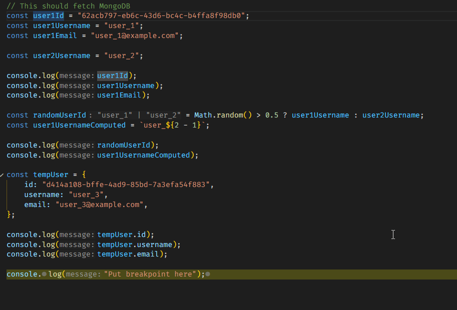
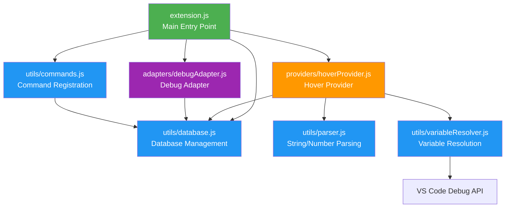

# HoverLookup


&label=updated%20with&color=rgb(74%2C%20100%2C%20206)&link=https%3A%2F%2Fgithub.com%2FIcaruk%2Fup-npm)

#### Instantly see what those IDs, codes, and numbers mean by hovering over them.

Stop switching between your code and database queries. 
Supported databases:

- Local JSON database:  
  

- MongoDB:  
  

Works in the debugger too:  



---

## Why HoverLookup?

Ever found yourself staring at code like this?

```javascript
const user = getUser(12345);
processOrder("ORD-2024-ABC");
```

**What does `12345` mean? Who is that user? What's in order `ORD-2024-ABC`?**

With HoverLookup, you **hover** and instantly see:

```json
{
  "id": 12345,
  "name": "Sarah Johnson",
  "email": "sarah@example.com",
  "role": "admin"
}
```

---

## Key Features

### Hover Over Anything
- **Literals**: Hover over `1`, `"abc"`, or any value in your code (works in any language)
- **Variables**: Hover over variables during debugging to see their runtime value + database info
- **Language support**: Literals work everywhere; variable analysis optimized for JavaScript/TypeScript

### Smart & Flexible
- **Dynamic ID field**: Use `id`, `userId`, `code`, `sku`, or any field as your lookup key
- **Auto-reload**: Database updates automatically when your JSON file changes
- **Debug integration**: Works seamlessly with VSCode's debugger
- **MongoDB support**: Query MongoDB collections on-demand (configurable per collection)

### Multiple databases

- Local JSON database
- MongoDB

---

## Quick Start for local JSON database

### 1. Initialize the Database

Open the Command Palette (`Ctrl+Shift+P` / `Cmd+Shift+P`) and run:

```
HoverLookup: Initialize Database
```

This creates a `lookup-database.json` file with an example structure.

### 2. Add Your Data

Edit the JSON file with your own data. You can use a **single field** or **multiple fields** for lookups:

**Single ID field:**
```json
{
  "idField": "id",
  "data": [
    {"id": 1, "name": "John Doe", "email": "john@example.com"},
    {"id": 2, "name": "Jane Smith", "email": "jane@example.com"}
  ]
}
```

**Multiple ID fields (mix different object types):**
```json
{
  "idField": ["id", "userId", "code"],
  "data": [
    {"id": 1, "name": "John Doe", "role": "admin"},
    {"userId": 42, "name": "Jane Smith", "department": "Engineering"},
    {"code": "ORD-2024-001", "status": "shipped", "total": 299.99}
  ]
}
```

When using multiple fields, the extension will try each field in order until it finds a value.

### 3. Start Hovering!

```javascript
const userId = 1;              // Hover over "1" → see John Doe's info
const employee = 42;           // Hover over "42" → see Jane Smith's info
const order = "ORD-2024-001";  // Hover over "ORD-2024-001" → see order details
```

## Quick Start for MongoDB

### 1. Configure MongoDB Connection

Open your VSCode settings and add your MongoDB connection URL:

```json
{
  "hoverLookup.mongodbUrl": "mongodb://localhost:27017"
}
```

### 2. Configure Collections to Search

Add the collections you want to search in your MongoDB database:

```json
{
  "hoverLookup.mongodbCollections": [
    {
      "collection": "users",
      "searchFields": ["id", "email"],
      "project": {
        "name": 1,
        "email": 1,
        "status": 1
      }
    },
    {
      "collection": "products",
      "searchFields": ["sku", "code"],
      "project": {
        "name": 1,
        "price": 1,
        "stock": 1
      }
    }
  ]
}
```

---


## Advanced Configuration

### Custom Database Path

Set a custom path in your VSCode settings:

```json
{
  "hoverLookup.databasePath": "data/my-custom-db.json"
}
```

The extension will try each field in order until it finds a match.

---

## How It Works

HoverLookup operates in two modes:

- Normal Editing Mode
  - Detects literals and variables using static analysis, then looks them up in your databases.

- Debug Mode
  - Intercepts the debugger's variable evaluation, extracts runtime values, and enriches the hover with databases information.

---

## Architecture

Built with a clean, modular structure for maintainability and extensibility:



---

## Known Limitations

- **Literal detection** (strings, numbers) works in all languages
- **Variable static analysis** is optimized for JavaScript/TypeScript syntax (`const`, `let`, `var`)
- For other languages or complex expressions, use the debugger for accurate variable lookups
- Static analysis only works for simple assignments in the same file
